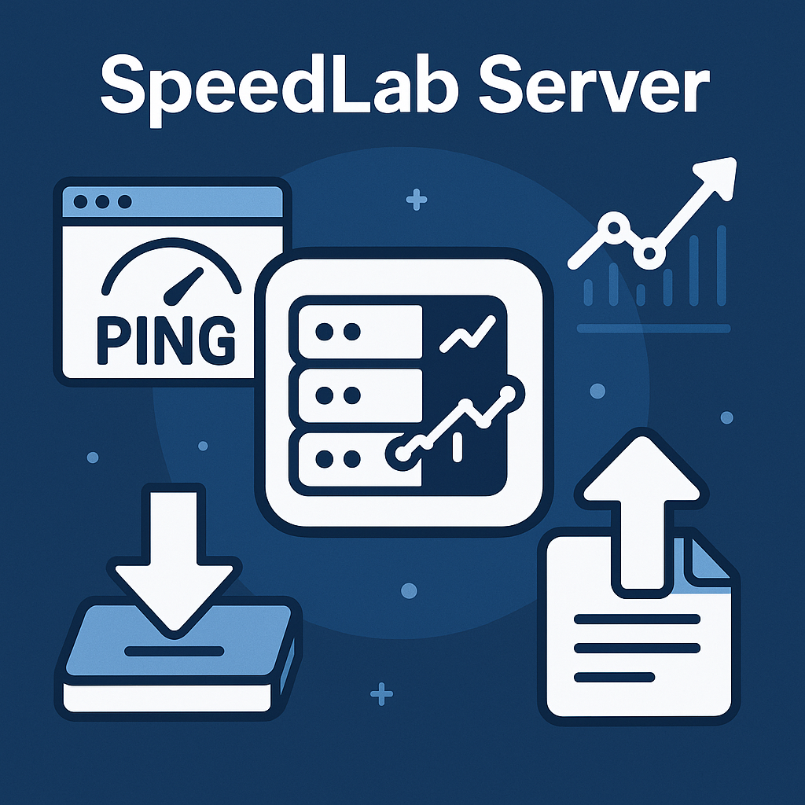

<p align="center">
  
</p>

<h1 align="center">SpeedLab Server</h1>

<p align="center">
A minimal Vapor server for internet speed testing and latency measurement.
</p>

<p align="center">
  <a href="https://swift.org">
    
  </a>
  <a href="https://swift.org/package-manager/">
    
  </a>
  
  <a href="https://vapor.codes">
    
  </a>
  <a href="LICENSE">
    
  </a>
  
</p>

<p align="center">
  <a href="README-ru.md">Русская версия</a>
</p>

## Features

- **GET /ping** - RTT/server liveness check
- **GET /download?size=N** - Download synthetic file of specified size (for download speed testing)
- **POST /upload** - Upload file to server (for upload speed testing)
- **GET /files/{filename}** - Download uploaded file

## Requirements

- macOS 14+
- Xcode 15+ (or Swift toolchain)
- Swift 5.10+/6.0

## Installation and Running

### Build

```bash
swift build
```

### Run

```bash
swift run Run
```

The server will start at `http://0.0.0.0:8080`

## API Endpoints

### 1. Ping (liveness check)

```bash
curl http://127.0.0.1:8080/ping
```

**Response:**
```json
{
  "status": "pong"
}
```

### 2. Download synthetic file

Downloads a file of specified size (in bytes) for speed testing.

```bash
# Download 1 MB
curl "http://127.0.0.1:8080/download?size=1048576" --output test.bin

# Download 10 MB
curl "http://127.0.0.1:8080/download?size=10485760" --output test.bin
```

**Parameters:**
- `size` - file size in bytes (1..104857600, max 100 MB)
- Default: 131072 (128 KB)

### 3. Upload file to server

```bash
curl -F "file=@sample.txt" http://127.0.0.1:8080/upload
```

**Response:**
```json
{
  "filename": "sample.txt",
  "size": 1234,
  "url": "/files/sample.txt"
}
```

### 4. Download uploaded file

```bash
curl http://127.0.0.1:8080/files/sample.txt --output downloaded.txt
```

## Local Network Access

The server listens on `0.0.0.0:8080`, allowing connections from other devices on the same network.

Find your Mac's IP address:

```bash
ifconfig | grep "inet " | grep -v 127.0.0.1
```

Then use this IP on another device:

```bash
curl http://192.168.1.42:8080/ping
```

## Project Structure

```
SpeedLabServer/
 ├─ Package.swift
 ├─ Sources/
 │  ├─ App/
 │  │  ├─ configure.swift
 │  │  ├─ routes.swift
 │  │  └─ Controllers/
 │  │     ├─ PingController.swift
 │  │     └─ FileController.swift
 │  └─ Run/
 │     └─ main.swift
 ├─ Storage/
 │  └─ uploads/
 └─ cleanup.sh          # Clean temporary upload files
```

## Maintenance

### Cleaning uploaded files

To remove temporary test files from the `Storage/uploads/` directory:

```bash
./cleanup.sh
```

This script removes all files except `.gitkeep`.

## Configuration

- Maximum upload file size: 50 MB
- Maximum synthetic download file size: 100 MB
- Uploaded files are stored in `Storage/uploads/`
- `Cache-Control: no-store` headers prevent caching for accurate speed measurements

## Production Notes

For production use, consider:

1. Enable HTTPS (TLS)
2. Add authentication for `/upload` endpoint
3. Configure rate limiting
4. Set up automatic cleanup/rotation of uploaded files
5. Use a reverse proxy (e.g., Nginx) for serving static files
6. Add monitoring and logging
7. Configure firewall rules
8. Set up proper error handling and validation

## Security Considerations

- File uploads are sanitized to prevent directory traversal attacks
- Duplicate filenames are handled with timestamp prefixes
- File size limits are enforced
- No code execution of uploaded files

## License

MIT License - see LICENSE file for details

## Contributing

Contributions are welcome! Please feel free to submit a Pull Request.

## Author

Created by SpaceZeroLab
